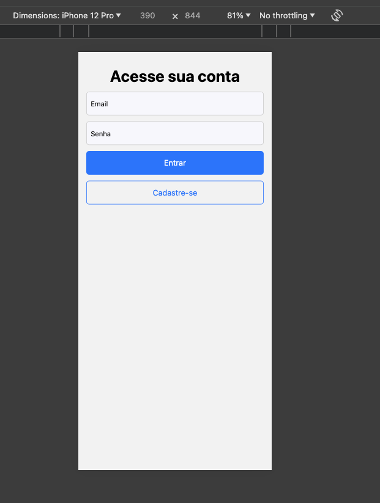

# Autstudy
Autstudy is an application designed to improve interaction and communication between students with autism spectrum disorder and their teachers.

## Running Guide

###  Requirements
- [Docker](https://www.docker.com/)
- [Node/NPM](https://nodejs.org/en)

### Docker Container (PostgreSQL)
```
cd server
docker compose up -d
```

### Server (API)
```
cd server
npm install 
npm run dev
```
- It will start running at [http://localhost:3333](http://localhost:3333)

#### Prisma Migration (Database)
```
cd server
npm run migrate
```

#### 📱 Mobile (React Native)
```
cd mobile
npm install 
npm run web
```
- It will start running at [http://localhost:8081/](http://localhost:8081)

Ps:. During development, we use the browser to facilitate real-time visualization of the application because we developed our own API. We recommend to open the application with the DevTools (mobile) in the browser.

